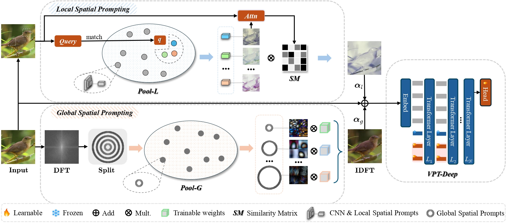

# [ICCV2025]LGSP-Prompt: Revisiting Pool-based Prompt Learning for Few-shot Class-incremental Learning

<div align="center">

[](https://iccv.thecvf.com/)
[](https://arxiv.org/abs/2507.09183)
[](https://github.com/Jywsuperman/LGSP)
[](./LICENSE)

**Authors:** Yongwei Jiang, Yixiong Zou*, Yuhua Li, Ruixuan Li  
**Affiliation:** School of Computer Science and Technology, Huazhong University of Science and Technology

</div>

---

## 🔥 News

* **`2025.09.28`** 📝 Code and implementation released
* **`2025.06.26`** 🎉 Our paper is **accepted at ICCV 2025**!

## 💡 Highlights

<div align="center">

</div>

> **TLDR:** We present the **first study** of pool-based prompt learning in FSCIL settings, revealing **token-dimension saturation** issues when applying L2P to few-shot scenarios, and propose **LGSP-Prompt** that innovatively shifts from token dimension to **spatial dimension** for superior performance.

## 📦 Installation

### Prerequisites
- Python >= 3.8
- PyTorch >= 1.12.0
- timm >= 0.6.7
- Vision Transformer backbone

### Quick Setup
```bash
# Clone the repository
git clone https://github.com/Jywsuperman/LGSP.git
cd LGSP

# Create conda environment
conda create -n lgsp python=3.9 -y
conda activate lgsp

# Install PyTorch (match your CUDA version)
pip install torch==1.12.1 torchvision==0.13.1 torchaudio==0.12.1 --index-url https://download.pytorch.org/whl/cu116

# Install all dependencies
pip install -r requirements.txt
```


## 📁 Dataset Preparation

### Datasets Overview

<div align="center">

| Dataset | Domain | Images | Base Classes | Novel Classes | Download |
|:-------:|:------:|:------:|:------------:|:-------------:|:--------:|
| **CUB-200** | Birds | 11,788 | 100 | 100 (10 sessions, 10 classes each) | [GDrive](https://drive.google.com/drive/folders/1oeptY4wRffZb-srrlqx47Z-k8jxRWVX3?usp=sharing) / [Baidu Pan](https://pan.baidu.com/s/1Y8VIHjrxPKMhyupehkJ1aw?pwd=LGSP) |
| **iNF200** | Fungi | 10,000 | 100 | 100 (10 sessions, 10 classes each) | [GDrive](https://drive.google.com/drive/folders/1oeptY4wRffZb-srrlqx47Z-k8jxRWVX3?usp=sharing) / [Baidu Pan](https://pan.baidu.com/s/1Y8VIHjrxPKMhyupehkJ1aw?pwd=LGSP) |
| **FGVC-Aircraft** | Aircraft | 10,000 | 50 | 50 (10 sessions, 5 classes each) | [GDrive](https://drive.google.com/drive/folders/1oeptY4wRffZb-srrlqx47Z-k8jxRWVX3?usp=sharing) / [Baidu Pan](https://pan.baidu.com/s/1Y8VIHjrxPKMhyupehkJ1aw?pwd=LGSP) |

</div>

**Note**: Novel classes are divided into sessions for incremental few-shot learning

### Directory Structure

```bash
your_workspace/
├── 🔵 LGSP/ # This repository (contains session splits)
│ ├── data/
│ │ └── index_list/ # Session split files
│ ├── models/
│ ├── utils_data/
│ └── train.py
│
└── 📂 data/ # Dataset folder (same level as LGSP)
│
├── 🟢 CUB_200_2011/ # Bird species dataset
│ ├── attributes/
│ ├── images/
│ ├── classes.txt
│ └── ...
│
├── 🟡 fgvc-aircraft-2013b/ # Aircraft dataset
│ ├── data/
│ │ ├── images/
│ │ └── variants.txt
│ └── ...
│
└── 🟣 iNF200/ # Natural image dataset
├── train_mini/
│ └── [class folders]
└── val/
└── [class folders]
```

## 🚀 Quick Start

### Training LGSP-Prompt

Run the training script with pre-configured parameters:

```bash
cd run_script
python vit_run_pretrain.py
```

### Configuration

Modify parameters in `run_script/vit_run_pretrain.py`:

```python
# Dataset selection (uncomment one)
dataset = 'cub200'
# dataset = 'FGVCAircraft' 
# dataset = 'iNF200'

# Training parameters
epochs_bases = [80]    # Base session epochs
epochs_new = 5         # Novel session epochs
gpu_num = 1           # GPU ID

# Learning rates
lr_base = 0.01        # Base classifier LR
lr_new = 0.06         # Novel classifier LR
lr_PromptTokens_base = 0.02   # Base prompt tokens LR
lr_PromptTokens_novel = 0.003 # Novel prompt tokens LR

# Data directory
data_dir = '/path/to/your_workspace/data'  # Update this path
```

### Manual Training (Alternative)

You can also run training directly:

```bash
# FGVCAircraft FSCIL
python train.py \
    -project base \
    -dataset FGVCAircraft \
    -base_mode ft_dot \
    -new_mode avg_cos \
    -lr_base 0.01 \
    -lr_new 0.06 \
    -epochs_base 80 \
    -epochs_new 5 \
    -gpu 0 \
    -vit \
    -dataroot /path/to/your_workspace/data
```

**Note**: For different datasets, simply change the `dataset` variable in the configuration file.

## 📜 Citation

If you find our work useful for your research, please cite:

```bibtex
@misc{jiang2025revisitingpoolbasedpromptlearning,
      title={Revisiting Pool-based Prompt Learning for Few-shot Class-incremental Learning}, 
      author={Yongwei Jiang and Yixiong Zou and Yuhua Li and Ruixuan Li},
      year={2025},
      eprint={2507.09183},
      archivePrefix={arXiv},
      primaryClass={cs.CV},
      url={https://arxiv.org/abs/2507.09183}, 
}
```

## 🤝 Acknowledgments

We thank the authors of the following works that inspired our research:
- [L2P](https://github.com/JH-LEE-KR/l2p-pytorch) for pioneering prompt pool learning
- [VPT](https://github.com/KMnP/vpt) for visual prompt tuning foundation
- [PriViLege](https://github.com/KU-VGI/PriViLege) for FSCIL baselines


## 📄 License

This project is licensed under the MIT License - see the [LICENSE](LICENSE) file for details.

## 📧 Contact

- **Yongwei Jiang**: jiangyongwei@hust.edu.cn
- **GitHub Issues**: [Create an issue](https://github.com/Jywsuperman/LGSP/issues)

---

<div align="center">

**🌟 Star this repo if you find it helpful! 🌟**

*"From token saturation to spatial innovation - rethinking prompt learning for FSCIL"*

</div>
